# 🤖 Multi-Agent MCP Orchestration System

A distributed, scalable multi-agent system using the Model Context Protocol (MCP) for intelligent workflow orchestration and complex task automation.

## 🎯 Project Overview

This system enables **intelligent agent orchestration**—coordinating multiple specialized AI agents to perform complex workflows based on natural language goals. Instead of requiring explicit workflow calls, you simply describe your goal (e.g., "summarize this PDF"), and the system automatically plans and executes the appropriate workflow using available agents and tools.

## 🏗️ Architecture

```mermaid
graph LR
    subgraph "Current Usage"
        A1[🤖 Intelligent Interface<br/>process_user_request]
        A2[🔧 Explicit Interface<br/>MultiAgentOrchestrator]
    end
    
    subgraph "Future: UI Integration"
        A3[🌐 Web UI]
        A4[📱 Mobile App]
        A5[🔌 API Gateway<br/>Future: Auth, Rate Limiting, etc.]
    end
    
    subgraph "Interface Layer"
        C1[🤖 Intelligent Interface<br/>process_user_request]
        C2[🔧 Explicit Interface<br/>MultiAgentOrchestrator<br/>task-oriented]
    end
    
    subgraph "Orchestration Layer"
        D[Intelligent Orchestrator<br/>Workflow Planning & Coordination]
        E[Workflow Engine<br/>Execution & Error Handling]
        F[Planners<br/>Pattern + Dynamic Planning]
        G[Matchers<br/>Intent Analysis]
        H[MultiAgent Orchestrator<br/>Agent Management & MCP Communication]
        LLM[🤖 LLM<br/>FUTURE: AI-Powered <br/>Planning & Matching]
    end
    
    subgraph MCP_AGENTS_LAYER["MCP Agents Layer"]
        J[📄 Textract Agent]
        K[🤖 Summarize Agent]
        L[⚡ Energy Agent]
        M[🗄️ DB Admin Agent]
        I[⏰ Time Agent]
        LOC[🌍 FUTURE: Location Agent]
    end
    
    subgraph "External Services"
        N[AWS Textract<br/>OCR]
        O[Google Gemini<br/>LLM]
        P[PostgreSQL<br/>DB]
    end
    
    %% Current direct usage
    A1 --> C1
    A2 --> C2
    
    %% Future UI path (dashed lines)
    A3 -.-> A5
    A4 -.-> A5
    A5 -.-> C1
    A5 -.-> C2
    
    %% Intelligent interface flow (through orchestration layer)
     C1 --> D
    D --> F
    F --> G
    G --> E
    E --> H
    
    %% Future LLM connections (dashed lines)
    LLM -.-> F
    LLM -.-> G
    %% LLM -.-> E
    
    %% Explicit interface flow (direct to MCP agents)
    C2 --> H

    %% Orchestrator to agents layer
    H --> MCP_AGENTS_LAYER
    
    %% Agents to external services
    J --> N
    K --> O
    L --> P
    M --> P
```



## 🚀 Key Features

### 🤖 **Intelligent Interface**
- Accepts natural language goals (e.g., "summarize this PDF")
- Automatically plans and executes multi-agent workflows
- No need to call explicit workflow methods—just state your intent
- Uses `process_user_request(goal, **context)` function

### 🔄 **Pre-built & Dynamic Workflows**
- **PDF Processing**: "summarize this PDF" → Extract text → Summarize
- **Energy Consumption Analysis**: "analyze building energy consumption" → Get energy data → Generate insights
- **Document Analysis**: "analyze the sentiment of this document" → Extract data → Analyze sentiment

### 🔍 **Agent Discovery**
- Automatically discovers available tools from each agent
- Dynamically routes requests to the appropriate agent(s)

### 📊 **Modular Architecture**
- **Base Orchestrator**: Core agent management and MCP communication
- **Planners**: Pattern-based and dynamic workflow planning strategies
- **Matchers**: Intent analysis and tool matching
- **Workflow Engine**: Executes multi-step workflows with error handling
- **Intelligent Orchestrator**: Main coordinator that composes all components
- **Intelligent Interface**: Natural language goal processing via `process_user_request`
- **Explicit Interface**: Direct agent control via `MultiAgentOrchestrator` (bypasses intelligent components)

### 🎯 **Planning Strategies**
- **Pattern Planning**: Uses pre-defined patterns for common tasks (e.g., "summarize PDF" → textract + summarize)
- **Dynamic Planning**: AI-based workflow composition for unknown requests
- **Hybrid Planning**: Combines both approaches for optimal results
- **Intent Matching**: Analyzes user goals and maps to available tools

## 🧠 How the Planning System Works

The planning system converts your natural language goals into executable workflows using multiple strategies:

### **Pattern-Based Planning**
When you say `"summarize this PDF"`, the system:

1. **Extracts keywords**: `["pdf", "summarize"]`
2. **Scores patterns**: Matches against pre-defined workflow patterns
3. **Selects best match**: `"summarize_pdf"` pattern (score: 2)
4. **Creates workflow**:
   ``` text
   Step 1: textract.extract_text(file_path="...")
   Step 2: summarize.summarize_text(text="{{step_0.full_text}}")
   ```

### **Dynamic Planning (Future)**
For unknown requests, the system will:
- Use AI/ML to analyze the goal
- Discover available tools from all agents
- Dynamically compose workflows based on tool capabilities
- Optimize for efficiency and success rate

### **Hybrid Approach**
The system combines both strategies:
- Try pattern matching first (fast, reliable)
- Fall back to dynamic planning (flexible, intelligent)
- Provide the best of both worlds

## 🚀 Quick Start

### 1. Setup Environment
```bash
cd apexory/agentic-system

# Create and activate virtual environment
python -m venv venv
source venv/bin/activate  # On Windows: venv\Scripts\activate

# Install dependencies
pip install -r requirements.txt
```

**Note:** After initial setup, use `./activate_venv.sh` for all Python commands to ensure the virtual environment is activated:

### 2. Configure Environment Variables
Create a `.env` file with your API keys:
```bash
# AWS Configuration
AWS_ACCESS_KEY_ID=your_aws_access_key
AWS_SECRET_ACCESS_KEY=your_aws_secret_key
AWS_REGION=us-west-2

# Google AI Configuration
GOOGLE_API_KEY=your_google_api_key

# Database Configuration
POSTGRES_HOST=localhost
POSTGRES_PORT=5432
POSTGRES_DATABASE=energy_db
POSTGRES_USER=energyapp
POSTGRES_PASSWORD=energypass
```

### 3. Setup Database (Optional)
```bash
# Setup database with sample data
./scripts/database/setup_database.sh

# Test database connection
./scripts/database/test_database.sh
```

### 4. Configure MCP (Optional)
```bash
# Generate MCP configuration for Cursor IDE
./scripts/mcp/configure.sh

# Test MCP client
./activate_venv.sh python scripts/mcp/working_mcp_client.py
```

### 5. Run Examples
```bash
# Activate virtual environment first
./activate_venv.sh

# Energy analysis example
python examples/energy/energy_orchestration_example.py

# PDF processing example
python examples/pdf/pdf_orchestration_example.py

# Database operations example
python examples/database/database_orchestration_example.py
```

**Or run with virtual environment activation in one command:**
```bash
# Energy analysis example
./activate_venv.sh python examples/energy/energy_orchestration_example.py

# PDF processing example
./activate_venv.sh python examples/pdf/pdf_orchestration_example.py

# Database operations example
./activate_venv.sh python examples/database/database_orchestration_example.py
```

### 6. Test the System
```bash
# Run all tests
./activate_venv.sh python tests/run_tests.py

# Test specific components
./activate_venv.sh python -m pytest tests/integration/
./activate_venv.sh python -m pytest tests/unit/
```

### 7. Docker Development Environment (Optional)
```bash
# Setup Docker environment
cd infrastructure
docker-compose -f docker-compose.dev.yml up --build -d
```

## 📚 Documentation Structure

The project is organized with clear separation between technical and business documentation:

### **Core Documentation**
- **`README.md`** - Technical overview, architecture, and setup
- **`docs/DOCUMENTATION_INDEX.md`** - Complete documentation navigation

### **Agent-Specific Documentation**
- **`docs/agents/ENERGY_ORCHESTRATION.md`** - Energy service booking workflows and examples
- **`docs/agents/PDF_ORCHESTRATION.md`** - PDF processing workflows and examples
- **`docs/agents/DATABASE_ORCHESTRATION.md`** - Database operations and management

### **Learning Resources**
- **`docs/learning/MCP_LEARNING_GUIDE.md`** - MCP protocol learning guide
- **`docs/orchestration/README.md`** - Orchestration system details

### **Examples**
- **`examples/energy/`** - Energy analysis examples
- **`examples/pdf/`** - PDF processing examples
- **`examples/database/`** - Database operation examples

### **Data & Infrastructure**
- **`data/`** - Database schema, seed data, and other data files
- **`infrastructure/`** - Docker and deployment configuration

## 🔧 Usage Examples

### 🤖 **Intelligent Interface (Recommended)**

The intelligent interface accepts natural language goals and automatically plans workflows using the `process_user_request` function:

```python
from orchestration import process_user_request
import asyncio

# Example: Summarize a PDF
goal = "summarize this PDF"
context = {"file_path": "files/Inspirational Career Summary Report.pdf", "max_length": 200}
result = asyncio.run(process_user_request(goal, **context))
print(result)
```

### Natural Language Goal-Based Workflows
```python
# Summarize a PDF
goal = "summarize this PDF"
context = {"file_path": "files/Inspirational Career Summary Report.pdf"}
result = await process_user_request(goal, **context)

# Analyze sentiment of a document
goal = "analyze the sentiment of this document"
context = {"file_path": "files/Inspirational Career Summary Report.pdf"}
result = await process_user_request(goal, **context)

# Analyze energy consumption
goal = "analyze energy consumption for this building"
context = {"building_id": 1, "start_date": "2024-01-01", "end_date": "2024-01-31", "analysis_type": "consumption"}
result = await process_user_request(goal, **context)
```

### 🔧 **Explicit Interface (Advanced)**

For developers who need fine-grained control, debugging, or custom workflows using the `MultiAgentOrchestrator` class:

```python
from orchestration import MultiAgentOrchestrator
import asyncio

orchestrator = MultiAgentOrchestrator()

# Start specific agents
await orchestrator.start_agents(["textract", "summarize"])

# Call tools directly on specific agents
extract_result = await orchestrator.call_agent_tool("textract", "extract_text", {
    "file_path": "files/Inspirational Career Summary Report.pdf"
})

summary_result = await orchestrator.call_agent_tool("summarize", "summarize_text", {
    "text": extract_result["text"],
    "max_length": 200
})
```

### 🎯 **When to Use Each Interface**

| Use Case | Interface | Example |
|----------|-----------|---------|
| **Quick prototyping** | Intelligent | `process_user_request("summarize this PDF")` |
| **End-user applications** | Intelligent | Natural language goals |
| **Debugging workflows** | Explicit | `MultiAgentOrchestrator().call_agent_tool()` |
| **Performance optimization** | Explicit | Direct agent calls (no overhead) |
| **Legacy integrations** | Explicit | Existing code compatibility |
| **Custom business logic** | Explicit | Fine-grained control |
| **Direct agent access** | Explicit | Bypass intelligent orchestration |

### 🔄 **Interface Relationship**

- **Intelligent Interface** (`process_user_request`) uses **IntelligentOrchestrator** internally
- **Explicit Interface** (`MultiAgentOrchestrator`) provides direct access to agents and tools
- Both interfaces can access the same underlying agents and capabilities

### 🛣️ **Architecture Flow**

#### **Intelligent Interface Path**
``` text
process_user_request → IntelligentOrchestrator → WorkflowEngine → Planners/Matchers → MultiAgentOrchestrator → MCP Agents
```

#### **Explicit Interface Path**
``` text
MultiAgentOrchestrator → Direct MCP Communication → MCP Agents
```

The explicit interface bypasses the intelligent orchestration components and goes directly to the MCP agents layer for fine-grained control.

### 🔄 **Workflow Examples (Intelligent Interface)**

### 1. Document Processing Pipeline
```python
# Complete PDF processing workflow using intelligent interface
result = await process_user_request(
    "summarize this PDF",
    file_path="files/Inspirational Career Summary Report.pdf",
    max_length=200
)
# Returns: extraction stats + AI-generated summary
```

### 2. Sentiment Analysis Workflow
```python
# Sentiment analysis using intelligent interface
result = await process_user_request(
    "analyze the sentiment of this document",
    file_path="files/Inspirational Career Summary Report.pdf"
)
# Returns: text extraction + sentiment analysis
```

### 3. Energy Consumption Analysis
```python
# Energy consumption analysis using intelligent interface
result = await process_user_request(
    "analyze energy consumption for this building",
    building_id=1,
    start_date="2024-01-01",
    end_date="2024-01-31",
    analysis_type="consumption"
)
# Returns: analysis with consumption insights
```

## 📁 Project Structure

```text
agentic-system/
├── orchestration/           # Multi-agent orchestration engine
│   ├── __init__.py          # Main package exports
│   ├── intelligent_orchestrator.py  # Main entry point
│   ├── intelligent/         # Intelligent orchestration components
│   │   ├── __init__.py
│   │   ├── intelligent_orchestrator.py
│   │   ├── base_orchestrator.py
│   │   ├── workflow_engine.py
│   │   ├── models.py
│   │   ├── planners/        # Planning strategies
│   │   │   ├── __init__.py
│   │   │   ├── base_planner.py
│   │   │   ├── pattern_planner.py
│   │   │   ├── dynamic_planner.py
│   │   │   └── hybrid_planner.py
│   │   └── matchers/        # Intent matching strategies
│   │       ├── __init__.py
│   │       ├── base_matcher.py
│   │       ├── keyword_matcher.py
│   │       ├── semantic_matcher.py
│   │       └── intent_analyzer.py
│   ├── explicit/            # Explicit orchestration (future)
│   └── examples/            # Usage examples
│
├── tests/                   # Comprehensive test suites
│   ├── integration/         # End-to-end workflow tests
│   ├── unit/                # Unit tests for components
│   ├── setup/               # Test utilities and setup
│   └── files/               # Test data files
│
├── agents/                  # Individual MCP agent implementations
│   ├── textract_agent.py    # AWS Textract integration
│   ├── summarize_agent.py   # Google Gemini integration
│   ├── energy_agent.py      # Energy service booking simulation
│   ├── db_admin_agent.py    # Database operations
│   ├── start_agents.py      # Agent startup script
│   └── base_mcp_server.py   # Base MCP server class
│
├── scripts/                 # Utility scripts
│   ├── database/            # Database setup and testing
│   ├── mcp/                 # MCP configuration and testing
│   ├── development/         # Development utilities
│   └── README.md            # Scripts documentation
│
├── docs/                    # Documentation
│   ├── agents/              # Agent-specific documentation
│   ├── learning/            # Learning resources
│   ├── orchestration/       # Orchestration system docs
│   └── DOCUMENTATION_INDEX.md
│
├── examples/                # Usage examples
│   ├── energy/              # Energy service booking examples
│   ├── pdf/                 # PDF processing examples
│   └── database/            # Database operation examples
│
├── data/                    # Data files and schemas
├── infrastructure/          # Docker and deployment config
├── venv/                    # Virtual environment (created)
├── .env                     # Environment variables
├── requirements.txt         # Python dependencies
├── activate_venv.sh         # Virtual environment helper (USE THIS for all Python commands)
└── mcp.json                 # MCP configuration
```

## 🤖 Available Agents & Tools

| Agent | Purpose | Tools | Status |
|-------|---------|-------|--------|
| **Time** | Time utilities | `get_current_time`, `convert_time` | ✅ Working |
| **Textract** | PDF text extraction | `extract_text`, `extract_tables`, `extract_forms`, `analyze_document` | ✅ Working |
| **Summarize** | Text summarization | `summarize_text`, `summarize_file`, `extract_key_points`, `analyze_sentiment` | ✅ Working |
| **Energy** | Energy consumption analysis | `analyze_consumption`, `get_usage_data`, `generate_recommendations` | 🔧 Ready |
| **DB Admin** | Database operations | `query`, `insert`, `update` | 🔧 Ready |

## 🛠️ Development

### 🔧 **Modular Architecture Benefits**

The system has been refactored into a modular architecture for better maintainability:

- **Separation of Concerns**: Each component has a single responsibility
- **Testability**: Individual components can be tested in isolation
- **Extensibility**: Easy to add new workflow patterns or agents
- **Maintainability**: Clear boundaries between different system parts

### **Component Responsibilities**

| Component | Purpose | Key Features |
|-----------|---------|--------------|
| **MultiAgentOrchestrator** | Agent lifecycle management | Start/stop agents, direct MCP communication |
| **Planners** | Workflow planning | Pattern matching, dynamic composition |
| **Matchers** | Intent analysis | Goal interpretation, tool matching |
| **Workflow Engine** | Workflow execution | Step execution, error handling, result aggregation |
| **Intelligent Orchestrator** | Workflow coordination | Composes components, provides intelligent interface |
| **Intelligent Interface** | Natural language processing | `process_user_request` function, goal interpretation |
| **Explicit Interface** | Direct agent control | `MultiAgentOrchestrator` methods, bypasses intelligent components |

### Adding New Workflows
You can add new workflow patterns or rely on the intelligent composition engine. To add a new pattern, edit the `workflow_patterns` in `pattern_planner.py`.

### Adding New Agents
1. Create agent in `agents/` directory
2. Extend `base_mcp_server.py`
3. Add to orchestrator's agent list in `base_orchestrator.py`
4. Create tests in `tests/`

## 🧪 Testing

### **Comprehensive Test Suite**

The testing framework has been reorganized for better maintainability:

``` text
tests/
├── integration/     # End-to-end workflow tests
├── unit/           # Component-level tests
├── setup/          # Test utilities and setup
└── files/          # Test data files
```

### Test End-to-End PDF Workflow
```bash
./activate_venv.sh PYTHONPATH=orchestration python tests/integration/test_pdf_summary.py
```
This test demonstrates the complete PDF extraction and summarization workflow using AWS Textract and Google Gemini, driven by a natural language goal.

### Test Individual Components
```bash
# Test planners
./activate_venv.sh PYTHONPATH=orchestration python tests/unit/test_pattern_planner.py

# Test workflow engine
./activate_venv.sh PYTHONPATH=orchestration python tests/unit/test_workflow_engine.py

# Test base orchestrator
./activate_venv.sh PYTHONPATH=orchestration python tests/unit/test_base_orchestrator.py
```

### Test Individual Agents
```bash
# Test individual agent startup
./activate_venv.sh python start_agents.py textract
./activate_venv.sh python start_agents.py summarize

# Test MCP client with time server
./activate_venv.sh python scripts/mcp/working_mcp_client.py
```
Test individual agent startup and MCP protocol communication.

## 🎯 Goals & Roadmap

### ✅ **Completed**
- Intelligent orchestrator (natural language goal-driven)
- Multi-agent orchestration framework
- Agent discovery and routing
- Workflow engine with error handling
- Time agent integration (using official MCP Time Server)
- Textract agent with AWS integration
- Summarize agent with Google Gemini integration
- End-to-end PDF processing workflow
- Agent startup and cleanup management
- MCP protocol communication
- Environment configuration and logging
- **Modular architecture refactoring**
- **Comprehensive test suite reorganization**
- **Improved maintainability and extensibility**

### 🔧 **In Progress**
- Energy agent enhancements
- Database agent implementation
- Additional energy analysis workflows

### 🚀 **Planned**
- Location agent for global location awareness
- Advanced workflow scheduling
- Agent health monitoring
- Load balancing across agents
- Web UI for workflow management
- More complex workflow examples
- Production deployment

## 🔗 Integration

### With AI Assistants (MCP)
The system can be integrated with MCP-compliant clients like Cursor IDE:

```bash
# Generate MCP configuration
./scripts/mcp/configure.sh
```

This creates `.cursor/mcp.json` with all available agents:

```json
{
  "mcpServers": {
    "orchestrator": {
      "command": "python",
      "args": ["orchestration/intelligent_orchestrator.py"],
      "description": "Intelligent Multi-Agent Orchestrator"
    },
    "energy": {
      "command": "python",
      "args": ["agents/energy_agent.py"],
      "description": "Energy Analysis Agent"
    },
    "textract": {
      "command": "python",
      "args": ["agents/textract_agent.py"],
      "description": "AWS Textract Agent"
    },
    "summarize": {
      "command": "python",
      "args": ["agents/summarize_agent.py"],
      "description": "Google Gemini Agent"
    }
  }
}
```

### With Custom Applications
```python
from orchestration import process_user_request
import asyncio

result = asyncio.run(process_user_request(
    "summarize this PDF",
    file_path="files/Inspirational Career Summary Report.pdf"
))
```

## 📚 Documentation

### **System Documentation**
- [docs/learning/MCP_LEARNING_GUIDE.md](docs/learning/MCP_LEARNING_GUIDE.md) - Learn about the Model Context Protocol
- [agent-terminology-clarification.md](../agent-terminology-clarification.md) - Understand agent concepts
- [agentic-system-implementation-plan.md](../agentic-system-implementation-plan.md) - System implementation details

### **Application-Specific Guides**
- [docs/agents/ENERGY_ORCHESTRATION.md](docs/agents/ENERGY_ORCHESTRATION.md) - Energy service booking workflows and integration
- [docs/agents/PDF_ORCHESTRATION.md](docs/agents/PDF_ORCHESTRATION.md) - Document processing workflows
- [docs/agents/DATABASE_ORCHESTRATION.md](docs/agents/DATABASE_ORCHESTRATION.md) - Database operations and management

### **Documentation Index**
See [docs/DOCUMENTATION_INDEX.md](docs/DOCUMENTATION_INDEX.md) for a complete overview of all documentation.

## 🔧 Environment Setup

### Required Environment Variables
```bash
# AWS Configuration for Textract
AWS_ACCESS_KEY_ID=your_aws_access_key
AWS_SECRET_ACCESS_KEY=your_aws_secret_key
AWS_DEFAULT_REGION=us-west-2

# Google AI Configuration for Summarization
GOOGLE_API_KEY=your_google_api_key
```

### Dependencies
- Python 3.8+
- AWS SDK (boto3)
- Google AI Python SDK
- MCP Protocol libraries

### Virtual Environment Helper
The project includes a helper script for easy virtual environment management. **Use this script for all Python commands in the project:**

```bash
# Activate virtual environment and run a command
./activate_venv.sh python scripts/mcp/configure.sh

# Just activate the environment
./activate_venv.sh

# Run tests with virtual environment
./activate_venv.sh python -m pytest tests/
```

**Important:** Always use `./activate_venv.sh python` instead of just `python` to ensure the virtual environment is activated with the correct dependencies.

## 🤝 Contributing

1. Fork the repository
2. Create a feature branch
3. Add tests for new functionality
4. Submit a pull request

## 📄 License

This project is part of the Apexory ecosystem.

## 🎯 Recent Achievements

✅ **End-to-End PDF Workflow Success**: Successfully tested complete PDF extraction and summarization workflow  
✅ **Multi-Agent Coordination**: Proven coordination between AWS Textract and Google Gemini agents  
✅ **MCP Protocol Integration**: Robust communication using Model Context Protocol  
✅ **Production-Ready Architecture**: Scalable, extensible multi-agent orchestration system  
✅ **Modular Architecture**: Refactored into maintainable, testable components  
✅ **Comprehensive Testing**: Organized test suite with unit and integration tests  

## 📋 Documentation Index

| Document | Purpose | Audience | Key Topics |
|----------|---------|----------|------------|
| **[README.md](README.md)** | System overview and technical architecture | Developers, System Architects | Architecture, Setup, Core Features |
| **[docs/agents/ENERGY_ORCHESTRATION.md](docs/agents/ENERGY_ORCHESTRATION.md)** | Energy service booking workflows | Energy App Developers, Business Users | Energy Agent, Booking Patterns, Database Integration |
| **[docs/agents/PDF_ORCHESTRATION.md](docs/agents/PDF_ORCHESTRATION.md)** | Document processing workflows | Document Analysts, Content Managers | Textract, Summarize, AWS, Google AI |
| **[docs/agents/DATABASE_ORCHESTRATION.md](docs/agents/DATABASE_ORCHESTRATION.md)** | Database operations | Database Admins, Data Engineers | PostgreSQL, Schema Management, Queries |
| **[docs/learning/MCP_LEARNING_GUIDE.md](docs/learning/MCP_LEARNING_GUIDE.md)** | MCP protocol learning | MCP Developers, Protocol Enthusiasts | MCP Protocol, Agent Communication |
| **[agent-terminology-clarification.md](../agent-terminology-clarification.md)** | Agent concepts and terminology | All Users, Newcomers | Agent Types, Orchestration, MCP |

### **Quick Navigation**
- **Getting Started**: [README.md](README.md) → [Quick Start](#quick-start)
- **Energy Service Booking**: [docs/agents/ENERGY_ORCHESTRATION.md](docs/agents/ENERGY_ORCHESTRATION.md) → [Usage Examples](#usage-examples)
- **PDF Processing**: [docs/agents/PDF_ORCHESTRATION.md](docs/agents/PDF_ORCHESTRATION.md) → [Workflow Patterns](#workflow-patterns)
- **Database Operations**: [docs/agents/DATABASE_ORCHESTRATION.md](docs/agents/DATABASE_ORCHESTRATION.md) → [Agent Tools](#agent-tools)
- **Learning MCP**: [docs/learning/MCP_LEARNING_GUIDE.md](docs/learning/MCP_LEARNING_GUIDE.md) → [Protocol Basics](#protocol-basics)

---

**🎉 Multi-Agent Orchestration System Ready!** Coordinate multiple MCP agents for complex workflows and intelligent task automation with a clean, modular architecture. 

 